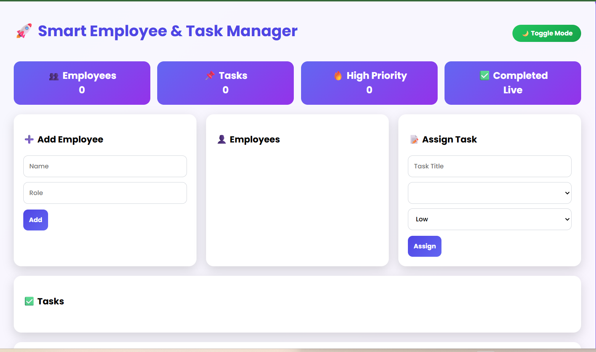
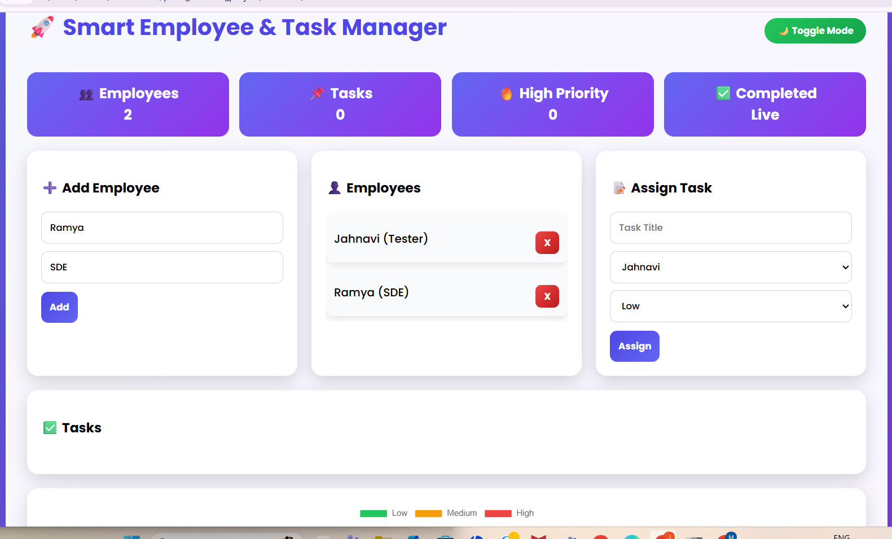
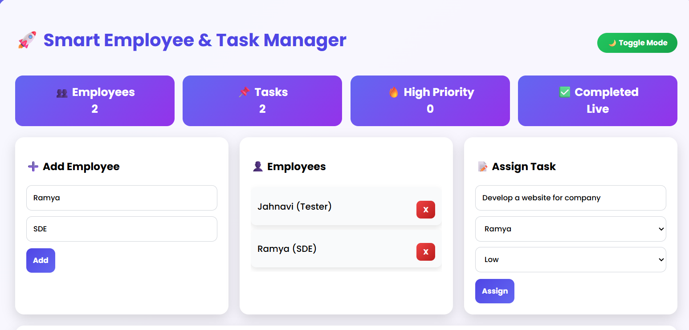
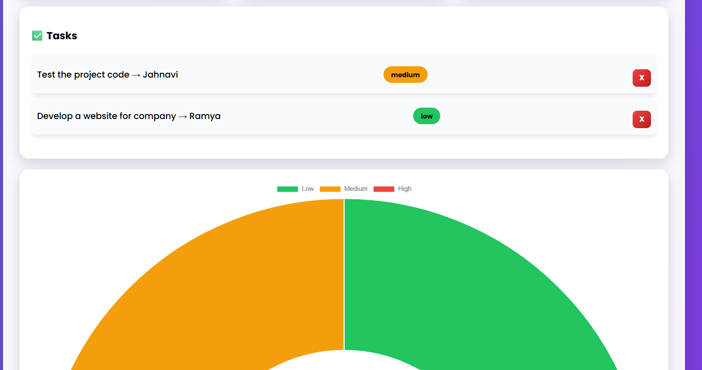

# 🚀 ProU Full Stack Employee & Task Management System

---

## ✅ Setup Steps (Text Format)

1. Download or clone this repository from GitHub to your local system.  
2. Open the project folder in your computer.  
3. Go inside the **backend** folder.  
4. Install all required dependencies using npm.  
5. Start the backend server using Node.js.  
6. Once the server is running, it will start on **http://localhost:3000**.  
7. Now go to the **frontend** folder.  
8. Open the **index.html** file in any web browser (Chrome, Edge, etc.).  
9. The application will now be ready to use.

---

## ✅ Tech Stack

### Frontend
- HTML5  
- CSS3  
- Vanilla JavaScript  
- Chart.js (for data visualization)

### Backend
- Node.js  
- Express.js  

### Database
- SQLite  

---

## ✅ Screenshots of UI

### 🏠 Dashboard

### 👤 Add & View Employees

### 📝 Assign Task

### ✅ Task List with Priority

---

## ✅ Any Assumptions or Bonus Features Implemented

### ✅ Assumptions
- Each task is assigned to one employee  
- Priority levels used: Low, Medium, High  
- SQLite is used as a local database  
- Frontend communicates with backend using Fetch API  

### ✅ Bonus Features Implemented
- Full Stack Integration (Frontend + Backend + Database)  
- Advanced UI Dashboard  
- Dark / Light Mode  
- Task Priority System  
- Live Statistics and Chart Visualization  

---

## ✅ Project Description

A modern **Full-Stack Web Application** built as part of the  
**ProU Technology Online Assessment** for:

- Track 1: Frontend – Web Development  
- Track 2: Backend – API + Database  
- Track 3: Full Stack – Web + API + Database  

This project demonstrates:
- Real-world CRUD operations  
- REST API integration  
- Database handling using SQLite  
- A creative and professional UI dashboard  

---

## ✅ Key Features

### ✅ Frontend (UI/UX)
- Modern dashboard layout  
- Dark / Light mode toggle  
- Responsive card-based design  
- Task priority badges (Low / Medium / High)  
- Live statistics (Employees & Tasks)  
- Doughnut chart visualization  
- Input validation & alerts  

### ✅ Backend (API + Database)
- RESTful APIs for Employees and Tasks  
- Full CRUD operations  
- SQLite database integration  
- Employee–Task relationship using JOIN  

### ✅ Full Stack Integration
- Frontend connected to backend using Fetch API  
- Real-time updates from database to UI  
- Complete CRUD flow from UI → API → Database  
